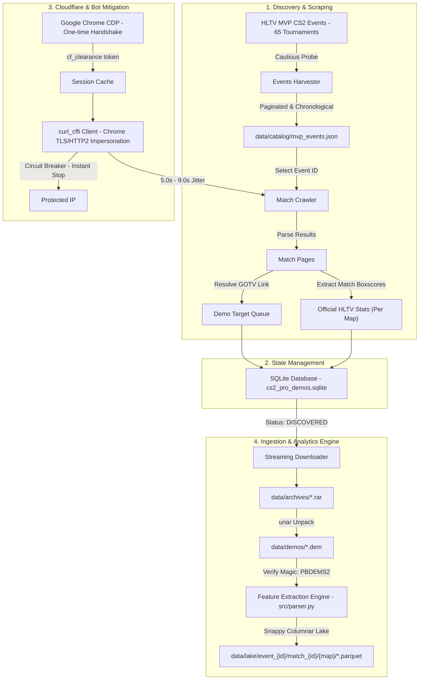

# CS2 Professional Match Demo Pipeline

An automated, ultra-defensive data pipeline for discovering, cataloging, downloading, extracting, and parsing Counter-Strike 2 (CS2) professional match demo files (`.dem`) and official HLTV statistics.

The pipeline is designed with Cloudflare resilience, zero-redundancy disk caching, circuit breaker protection, polite human-like jitter, high-performance feature extraction, and columnar Parquet lake partitioning. Peak disk usage is kept minimal through rolling worker processing.

---

## Dataset Overview & Milestones

- **Tournaments Ingested**: 65 / 65 concluded CS2 MVP tournaments (100% of all concluded MVP events from IEM Sydney 2023 through mid-2026).
- **Matches Ingested**: 1,787 matches parsed (out of 1,796 cataloged; 99.5% completion rate).
- **Map Partitions**: 4,321 map partitions under `data/lake/event_{id}/match_{id}/{map_name}/`.
- **Combat Kills**: 598,022 combat kills with 3D coordinates, 2D radar coordinates, trade latency attribution, and opening duel markers.
- **Damage Events**: 2,410,218 damage events.
- **Utility Detonations**: 1,915,181 grenade detonations (smokes, flashes, molotovs, HEs).
- **Rounds Tracked**: 89,836 rounds with freeze end/end tick, win reasons, and winning side.
- **Bomb Events**: 79,557 bomb plants, defusals, and explosions.
- **Official HLTV Stats**: 40,920 player map boxscores (ADR, KAST %, Rating 2.0 / 3.0, Round Swing %).
- **Parquet Data Lake Footprint**: ~472 MB compressed with Snappy (>99.8% compression ratio from >380 GB raw archives).

---

## Architecture



---

## Project Structure

```text
/Users/jankasen/dev/cs2/
|-- README.md
|-- requirements.txt
|-- explore.py                    # Fast interactive Polars query tool for data lake analytics
|-- data/
|   |-- archives/                 # Downloaded .rar archives (temporary or archived)
|   |-- cache/
|   |   |-- events/               # Raw HTML cache for event results pages
|   |   |-- matches/              # Raw HTML cache for individual match pages
|   |   `-- session_cookies.json  # Stored cf_clearance and browser fingerprint
|   |-- catalog/
|   |   |-- mvp_events.json       # All 66 CS2 MVP events catalog (chronological order)
|   |   `-- cs2_pro_demos.sqlite  # SQLite database tracking events, matches, stats, and demos
|   |-- demos/                    # Extracted CS2 .dem files organized by event/match
|   `-- lake/                     # Snappy-compressed columnar Parquet tables (partitioned)
`-- src/
    |-- config.py                 # Paths, rate limits, jitter settings, browser headers
    |-- db.py                     # SQLite WAL mode connection, schema, and upsert helpers
    |-- downloader.py             # Streaming downloader, unar extractor, and CS2 header checker
    |-- models.py                 # Data models: MVPEvent, Match
    |-- parser.py                 # Source 2 feature extraction engine (kills, damage, utility, bomb, rounds)
    |-- pipeline.py               # Rolling worker pipeline orchestrator
    |-- tournament_runner.py      # Resilient batch tournament runner with auto-checkpointing
    |-- utils/
    |   |-- cache.py              # DiskCache (ensures 0 redundant network calls)
    |   |-- client.py             # StealthHLTVClient with TLS impersonation & circuit breaker
    |   `-- session_manager.py    # Automated Chrome CDP Cloudflare clearance solver
    `-- scraper/
        |-- harvest_events.py     # Discovers and paginates all CS2 MVP events
        |-- harvest_matches.py    # Crawls event matches, resolves GOTV links, extracts stats
        |-- harvest_stats.py      # Parses official HLTV player boxscores and map results
        `-- sync_live_events.py   # Incremental syncer for newly concluded events and live matches
```


---

## Anti-Bot and Cloudflare Defenses

HLTV guards its match pages and demo downloads behind Cloudflare bot management. This pipeline implements a 4-layer defense:

1. **Automated CDP Clearance (`session_manager.py`)**:
   - Uses your installed Google Chrome via Chrome DevTools Protocol (CDP) to clear Cloudflare's interactive Turnstile challenge once.
   - Extracts the resulting `cf_clearance` cookie and matching `User-Agent`, persisting them to disk.

2. **TLS and HTTP/2 Impersonation (`curl_cffi`)**:
   - Subsequent requests impersonate real desktop Chrome (`impersonate="chrome124"`), preventing TLS client hello (JA3/JA4) fingerprint detection.

3. **Circuit Breaker**:
   - Every incoming response is checked for Cloudflare challenge markers (`"Just a moment..."`, Turnstile tokens, or 403 status).
   - If detected, the client immediately halts execution rather than spamming requests, protecting your IP address from blocks.

4. **Polite Pacing and Disk-First Caching**:
   - Enforces a randomized 5.0s to 9.0s delay between consecutive requests.
   - Every fetched HTML page is permanently cached locally. If you re-run or inspect matches, it reads from disk with 0 HTTP requests.

---

## Getting Started

### 1. Environment Setup

The project uses the `cs2` conda environment:

```bash
conda activate cs2
```

Required packages:

- `curl_cffi` (TLS/HTTP2 impersonation)
- `beautifulsoup4` (HTML parsing)
- `websockets` (CDP communication)
- `demoparser2` and `awpy` (CS2 Source 2 demo parsing)
- `polars` and `pyarrow` (High-performance Parquet generation)

### 2. Harvest MVP CS2 Events

Scrapes all tier-1 CS2 events from HLTV (starting with the inaugural CS2 event, IEM Sydney 2023):

```bash
python -m src.scraper.harvest_events
```

Outputs:

- [`data/catalog/mvp_events.json`](data/catalog/mvp_events.json) (65 events, 4,092+ maps)
- Populates the `events` table in the SQLite database.

### 3. Harvest Matches, Demo Targets, and HLTV Stats

To crawl all completed matches, resolve demo download links, and catalog official player scoreboard statistics:

```bash
# Example: Harvest all 29 matches for IEM Sydney 2023 (Event 6865)
python -m src.scraper.harvest_matches --event 6865

# Or limit to the first 5 matches for quick testing:
python -m src.scraper.harvest_matches --event 6865 --max-matches 5
```

Outputs:

- Populates `matches`, `demos`, `hltv_player_stats`, and `hltv_map_stats` tables in [`data/catalog/cs2_pro_demos.sqlite`](data/catalog/cs2_pro_demos.sqlite).
- HTML cached in `data/cache/matches/match_<id>.html`.
- Filters out aggregate "All maps" rows so that only granular map-by-map statistics are saved.

### 4. Download and Extract Demo Files

To stream-download and unpack demo files for any cataloged demo ID:

```bash
# Example: Download and extract Demo 82728 (Monte vs Complexity)
python -m src.downloader --demo 82728

# Optionally delete the raw .rar archive after extraction to save disk space:
python -m src.downloader --demo 82728 --delete-archive
```

Outputs:

- Streams the `.rar` archive into `data/archives/` using 2MB chunks.
- Decompresses via `unar` into `data/demos/<year>/<event>/match_<id>_<teams>/`.
- Validates the CS2 Source 2 magic header (`PBDEMS2\0`).
- Updates `status` to `EXTRACTED` in the SQLite database.

### 5. Parse Demos into Parquet Lake

To extract rich combat telemetry, trade kills, opening duels, utility events, and round states into columnar Parquet tables:

```python
from pathlib import Path
from src.parser import parse_demo_to_lake

demo_file = Path("data/demos/2023/IEM_Sydney_2023/match_2367128_Monte_vs_Complexity/monte-vs-complexity-anubis.dem")
results = parse_demo_to_lake(demo_file, match_id=2367128, event_id=6865)
print(results)
```

Outputs 5 Snappy-compressed tables under `data/lake/event_{event_id}/match_{match_id}/{map_name}/`:

- `rounds.parquet`: Round durations, winners (`T` or `CT`), win reasons (`target_bombed`, `bomb_defused`, `cts_win`, etc.).
- `kills.parquet`: 3D coordinates `(X, Y, Z)`, 2D normalized radar coordinates `[0.0, 1.0]`, pitch/yaw angles, weapon, hitgroup, headshot, wallbang, smoke status, opening duel flag (`is_first_kill`), and trade attribution (`is_trade_kill`, `traded_player_name`, `trade_ticks_delta`).
- `damage.parquet`: Per-impact damage, remaining HP/armor, attacker and victim coordinates.
- `utility.parquet`: Detonations for smokes, flashes, HE grenades, and molotovs with spatial coordinates.
- `bomb.parquet`: Bomb plant locations, defusals, and explosions.

### 6. Autonomous Rolling Worker Pipeline

The end-to-end rolling worker orchestrates automated downloads, unpacking, parsing, and garbage collection to process thousands of matches without exceeding host disk limits:

```bash
# Check queue status and host disk free space
python -m src.pipeline --status

# Preview next targets for an event without executing
python -m src.pipeline --event 6865 --dry-run --limit 5

# Process next 5 pending demos for IEM Sydney 2023
python -m src.pipeline --event 6865 --limit 5

# Process a specific demo ID
python -m src.pipeline --demo 82721

# Optional flags:
#   --keep-demos     Preserve extracted .dem files on disk
#   --keep-archives  Preserve downloaded .rar archives on disk
#   --force          Reprocess matches even if marked PARSED
```

**Worker Lifecycle per Match:**
1. Verifies host free disk space exceeds the 2.0 GB safety threshold.
2. Streams `.rar` archive directly from HLTV Cloudflare R2 storage.
3. Unpacks CS2 `.dem` files via `unar` and validates Source 2 magic header (`PBDEMS2\0`).
4. Extracts 5 Snappy Parquet tables into `data/lake/event_{id}/match_{id}/{map}/`.
5. Auto-purges temporary `.rar` and `.dem` files, keeping peak disk usage under 1.5 GB.
6. Updates SQLite `demos.status` to `PARSED`.
7. Applies polite pacing delay (5.0s - 9.0s jitter) before downloading the next match.

### 7. Tournament Batch Orchestrator (`src.tournament_runner`)

To orchestrate complete tournaments through harvesting, match crawling, demo resolution, and rolling ingestion with automated checkpointing and SQLite WAL concurrency:

```bash
# Ingest an entire tournament by Event ID
python -m src.tournament_runner --event 6865

# Ingest multiple tournaments in batch
python -m src.tournament_runner --events 6865,6972,7148

# Run all remaining pending tournaments across the entire catalog
python -m src.tournament_runner --all-events
```

### 8. Live Incremental Event Syncer (`src.scraper.sync_live_events`)

Continuously or incrementally queries HLTV to discover newly crowned championship events and detect map count increases while adhering to the concluded-only ingestion policy:

```bash
# One-shot check for newly concluded tournaments or map updates
python -m src.scraper.sync_live_events

# Run sync with automated end-to-end demo parsing for any new events
python -m src.scraper.sync_live_events --auto-parse

# Continuous daemon mode polling HLTV every 30 minutes
python -m src.scraper.sync_live_events --watch --interval 1800 --auto-parse
```

### 9. Interactive Analytics & Telemetry CLI (`explore.py`)

A high-speed interactive command-line tool built on Polars and PyArrow. Scans and aggregates across the entire 598,000+ kill dataset and 1.9M utility events in approximately 2 seconds:

```bash
# Run all telemetry summary benchmarks
python explore.py

# Query a specific metric view
python explore.py --kills          # Top kill leaders and headshot percentages
python explore.py --openings       # Opening duel conversion leaders by weapon
python explore.py --trades         # Trade kill reaction latency leaders
python explore.py --swing          # HLTV Round Swing % peak individual performances
python explore.py --utility        # Grenade detonation totals and map distributions
```

---

## Database Schema (`cs2_pro_demos.sqlite`)

### `events`

| Column | Type | Description |
| :--- | :--- | :--- |
| `event_id` | `INTEGER PRIMARY KEY` | HLTV Event ID (e.g. `6865`) |
| `name` | `TEXT` | Tournament name (e.g. `IEM Sydney 2023`) |
| `winner` | `TEXT` | Tournament winner (e.g. `FaZe`) |
| `maps_count` | `INTEGER` | Total maps played |
| `results_url` | `TEXT` | HLTV results URL |

### `matches`

| Column | Type | Description |
| :--- | :--- | :--- |
| `match_id` | `INTEGER PRIMARY KEY` | HLTV Match ID (e.g. `2367128`) |
| `event_id` | `INTEGER` | Foreign key to `events` |
| `team1` | `TEXT` | Team 1 name |
| `team2` | `TEXT` | Team 2 name |
| `score1` | `INTEGER` | Team 1 score |
| `score2` | `INTEGER` | Team 2 score |
| `format` | `TEXT` | Format (`bo1`, `bo3`, `bo5`) |
| `url` | `TEXT` | Match page URL |
| `match_date` | `TEXT` | Match timestamp |

### `demos`

| Column | Type | Description |
| :--- | :--- | :--- |
| `demo_id` | `INTEGER PRIMARY KEY` | HLTV GOTV demo archive ID (e.g. `82728`) |
| `match_id` | `INTEGER UNIQUE` | Foreign key to `matches` |
| `download_url` | `TEXT` | Direct download URL (`https://www.hltv.org/download/demo/{id}`) |
| `maps_json` | `TEXT` | JSON list of maps played (e.g. `["anubis"]`) |
| `status` | `TEXT` | Queue status (`DISCOVERED`, `DOWNLOADING`, `DOWNLOADED`, `EXTRACTED`, `PARSED`, `FAILED`) |
| `archive_path` | `TEXT` | Local path to `.rar` archive |
| `extracted_paths_json` | `TEXT` | Local paths to extracted `.dem` files |

### `hltv_player_stats`

| Column | Type | Description |
| :--- | :--- | :--- |
| `match_id` | `INTEGER` | Foreign key to `matches` |
| `event_id` | `INTEGER` | HLTV Event ID |
| `map_name` | `TEXT` | Map name (e.g. `Anubis`, `Mirage`) |
| `team` | `TEXT` | Team name |
| `player_id` | `INTEGER` | HLTV Player ID |
| `player_nick` | `TEXT` | Player nickname |
| `kills` | `INTEGER` | Kills |
| `deaths` | `INTEGER` | Deaths |
| `plus_minus` | `INTEGER` | Kill/death differential |
| `adr` | `REAL` | Average Damage per Round |
| `kast_pct` | `REAL` | Percentage of rounds with Kill, Assist, Survived, or Traded |
| `rating` | `REAL` | HLTV Rating 2.0 / 3.0 |
| `round_swing` | `REAL` | HLTV Round Swing % (percentage of round win probability contributed) |

### `hltv_map_stats`

| Column | Type | Description |
| :--- | :--- | :--- |
| `match_id` | `INTEGER` | Foreign key to `matches` |
| `event_id` | `INTEGER` | HLTV Event ID |
| `map_name` | `TEXT` | Map name |
| `team1` | `TEXT` | Team 1 name |
| `team2` | `TEXT` | Team 2 name |
| `score1` | `INTEGER` | Team 1 score |
| `score2` | `INTEGER` | Team 2 score |
| `half_scores` | `TEXT` | Half-time score splits |

---

## CS2 Demo Format Note

> [!NOTE]
> All professional match demos downloaded through this pipeline are Counter-Strike 2 Source 2 replays.
>
> Extracted `.dem` files begin with the 8-byte magic header:
>
> ```text
> PBDEMS2\0  (Protobuf Demo Source 2)
> ```
>
> *(In contrast to legacy CS:GO demos which begin with `HL2DEMO\0`)*.
